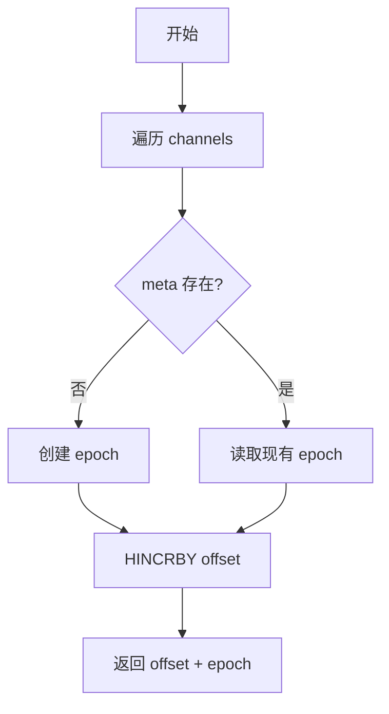
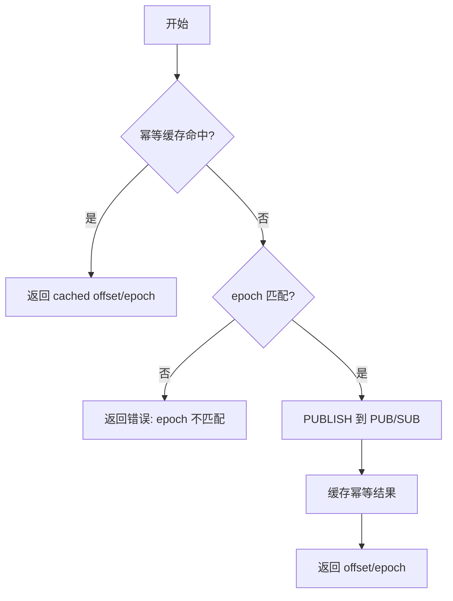

# centrifuge-plus 需求文档

> 版本：v2.0 | 日期：2026-07-27
>
> 变更：移除 Asynq 依赖，改为"先落盘再推送"模型。详见 [DRAFT.md](DRAFT.md)。

## 1. 项目概述

`centrifuge-plus` 是基于 [centrifuge v0.38.0](https://github.com/centrifugal/centrifuge) 的增强库，核心提供 `DualBroker`——一个实现了 centrifuge `Broker` 接口的路由器，内部根据频道类型将消息分发到不同的底层 broker。

**设计原则**：`centrifuge-plus` 不管理用户系统、频道订阅关系、业务逻辑。仅提供配置和接口，让接入者自行实现业务需求。

## 2. 核心概念

### 2.1 两种频道模式

| 模式 | 用途 | 持久化 | 实时推送 | 适用场景 |
|------|------|--------|----------|----------|
| **Live** | 非持久化 | 否 | 是 | 在线状态、实时消息流、打字机效果等高频低延迟场景 |
| **Topic** | 持久化 | 是 | 是 | 聊天记录、通知等需要可靠投递的场景 |

### 2.2 频道路由方式

频道路由通过**参数**指定，**不通过频道名前缀**。

**决策原因**：前缀方式侵入频道命名空间，且与 centrifuge 自身的 `$` 前缀（如 `$public:xxx`）容易冲突。参数方式更灵活、无侵入。

接入者在订阅时通过 option 指定频道类型：

```go
// 订阅时显式指定类型
node.Subscribe("channel-1", WithChannelType(Topic))
node.Subscribe("channel-1", WithChannelType(Live))
```

> **参考**：centrifuge 的 `SubscribeOptions` 结构体（`options.go:84`）已支持扩展自定义 option。

## 3. DualBroker

### 3.1 定义

`DualBroker` 实现 centrifuge 的 `Broker` 接口（`broker.go:134`），内部持有两个底层 broker，根据频道类型路由到对应 broker。

### 3.2 路由逻辑

- `Live` 类型频道 → 委托给 centrifuge 内置的 `RedisBroker`（`broker_redis.go:71`）
- `Topic` 类型频道 → 委托给自定义的 `TopicBroker`

### 3.3 配置

```go
type DualBrokerConfig struct {
    // Live 模式的 Redis 配置
    LiveRedis RedisBrokerConfig
    // Topic 模式的 TopicBroker 配置
    Topic TopicBrokerConfig
}
```

### 3.4 接口约束

DualBroker 必须实现 `Broker` 接口的所有方法：

- `RegisterBrokerEventHandler(BrokerEventHandler) error`
- `Subscribe(ch string) error`
- `Unsubscribe(ch string) error`
- `Publish(ch string, data []byte, opts PublishOptions) (StreamPosition, bool, error)`
- `PublishJoin(ch string, info *ClientInfo) error`
- `PublishLeave(ch string, info *ClientInfo) error`
- `History(ch string, opts HistoryOptions) ([]*Publication, StreamPosition, error)`
- `RemoveHistory(ch string) error`

此外，DualBroker 暴露 Topic 模式的扩展方法，供接入方实现"先落盘再推送"：

- `BatchIncrby(ctx context.Context, reqs []ChannelIncrbyRequest) (map[string]StreamPosition, error)`
- `PublishWithOffset(ctx context.Context, ch string, data []byte, opts PublishOptions, sp StreamPosition) error`

> **参考**：`Broker` 接口定义在 `broker.go:134-179`。

## 4. Live 模式

### 4.1 实现

直接使用 centrifuge 内置的 `RedisBroker`（`broker_redis.go:71`）。

### 4.2 禁用 Recovery

Live 模式**不使用** recovery 功能。目标：只向在线用户推送消息，用户离线即丢失。

**实现方式**：centrifuge 的 recovery 功能默认关闭，需客户端订阅时显式启用 `WithRecovery(true)`（`options.go:197`）。只要客户端不传入该 option，recovery 就不会执行。

> **参考**：`SubscribeOptions.EnableRecovery`（`options.go:119`），`WithRecovery`（`options.go:197`）。

### 4.3 适用场景

- 实时消息流（如聊天中的 streaming text，打字机效果）
- 在线状态通知
- 其他高频、低延迟、允许消息丢失的场景

## 5. Topic 模式

### 5.1 先落盘再推送模型

Topic 模式的消息需要同时完成两个目标：

1. **持久化**：在 DB 事务内写入消息和信箱记录（接入方自行实现）
2. **实时推送**：DB 事务提交后，通过 centrifuge 的 PUB/SUB 推送给当前在线的订阅者

**关键原则**：数据先落盘，再推送。推送是尽力而为（best-effort），失败不影响数据一致性。

**使用流程**：

```
Step 1: BatchIncrby     → 预分配 offset（Lua 脚本，原子批量 HINCRBY）
Step 2: DB 事务          → 写入消息 + 信箱记录（接入方自行实现）
Step 3: PublishWithOffset → 发布到 PUB/SUB（Lua 脚本，纯 PUBLISH）
```

**决策原因**：IM 场景下，如果 Publish 在 DB 事务内执行，事务回滚时 Redis 侧（stream + PUB/SUB）已提交脏数据。拆分为预分配 → 落盘 → 推送三步后，事务回滚只消耗 offset（产生 gap），不产生脏推送。

### 5.2 TopicBroker

自定义 broker，实现 `Broker` 接口。

#### 5.2.1 BatchIncrby 方法（预分配 offset）

在 DB 事务前调用，原子获取每个 channel 的下一个 offset。

```go
func (b *TopicBroker) BatchIncrby(ctx context.Context, reqs []ChannelIncrbyRequest) (map[string]centrifuge.StreamPosition, error)
```

内部执行 `lua/incrby_offset.lua`，对每个 channel 的 meta key 执行 `HINCRBY`，返回 `{offset, epoch}`。

**Lua 脚本流程**：



#### 5.2.2 PublishWithOffset 方法（推送）

在 DB 事务提交后调用，使用预分配的 offset 发布到 PUB/SUB。

```go
func (b *TopicBroker) PublishWithOffset(ctx context.Context, ch string, data []byte, opts centrifuge.PublishOptions, sp centrifuge.StreamPosition) error
```

内部执行 `lua/publish_with_offset.lua`。**无 HINCRBY，无 XADD，无 Asynq**。

**Lua 脚本流程**：



**epoch 校验**：Lua 脚本会校验传入的 epoch 与 Redis meta 中的 epoch 一致。如果不一致（说明 BatchIncrby 后 epoch 已变化），返回 `-1`，Go 端返回明确错误。

#### 5.2.3 Publish 方法（便捷方法）

保留 `Publish`/`PublishWithContext` 作为便捷方法，内部自动调用 `BatchIncrby` + `PublishWithOffset`。适用于不需要 DB 事务的场景（如简单实时通知）。

```go
func (b *TopicBroker) Publish(ch string, data []byte, opts PublishOptions) (StreamPosition, bool, error)
```

**注意**：IM 场景应使用 BatchIncrby + DB 事务 + PublishWithOffset，不要使用此便捷方法。

#### 5.2.4 History 方法

`History` 方法从接入者提供的 `HistoryStore`（数据库）读取历史消息。**不再从 Redis Stream 读取**。

```go
func (b *TopicBroker) History(ch string, opts HistoryOptions) ([]*Publication, StreamPosition, error) {
    pubs, err := b.historyStore.Query(ch, sinceOffset)
    sp := b.getStreamPosition(ch)  // 从 Redis meta key 读取 top_offset 和 epoch
    return pubs, sp, err
}
```

**决策原因**：改造后不再写入 Redis Stream（PublishWithOffset 只做 PUBLISH），History 统一从 HistoryStore 读取。客户端的恢复机制为：**实时推送（PUB/SUB）+ 主动拉取（DB 轮询）**。

#### 5.2.5 其他方法

- `Subscribe`/`Unsubscribe`：委托给内部的 PUB/SUB 管理
- `PublishJoin`/`PublishLeave`：在线状态事件，走 PUB/SUB
- `RemoveHistory`：调用 `HistoryStore` 的删除方法（如果接入者实现了的话）

### 5.3 HistoryStore 接口

接入者实现此接口，提供历史消息的查询能力。

```go
type HistoryStore interface {
    // Query 查询指定 channel 在 given offset 之后的消息
    Query(channel string, sinceOffset uint64) ([]*Publication, error)
}
```

**定位**：HistoryStore 是历史消息的**唯一数据源**。不再有 Redis Stream 作为热数据层。

接入者通常需要在 DB 事务内写入消息和信箱记录，然后通过 HistoryStore 接口提供查询。

### 5.4 边缘场景

#### 5.4.1 BatchIncrby 成功，DB 事务回滚

offset 被消耗，信箱表中产生 gap（例如 offset 5, 6, 8，缺 7）。

**处理方式**：接入者查询信箱表时发现 gap，返回 gap 类型记录。客户端收到 gap 后跳过该 offset，继续拉取后续记录。

#### 5.4.2 DB 事务成功，PublishWithOffset 失败

数据已在 DB，但在线客户端没收到实时推送。

**客户端发现时机**：

| 触发时机 | 能否发现 | 说明 |
|---|---|---|
| 客户端主动拉取信箱 | ✅ 能 | 查询 DB 中 offset > lastOffset 的记录 |
| 定期轮询（安全网） | ✅ 能 | 客户端每 N 秒拉一次增量更新 |

**结论**：客户端必须有主动拉取机制，不能只依赖 broker 的实时推送。

#### 5.4.3 Epoch 变化（offset 归 1）

当 `top_offset` 归 1 时（新 epoch），旧的 offset 失效。客户端需要检测 epoch 变化并做全量同步。

#### 5.4.4 PublishWithOffset epoch 不匹配

`BatchIncrby` 后 DB 事务耗时很长，期间 epoch 发生了变化（极少见）。Lua 返回 `-1`，Go 端返回明确错误。接入方可选择重试（重新 BatchIncrby）或记录日志。

### 5.5 适用场景

- 聊天记录
- 通知消息
- 其他需要持久化、可靠投递的场景

## 6. 服务端接入方式

### 6.1 写扩散示例

群消息复制到每个成员的个人信箱：

```go
// 获取群成员列表
members := getGroupMembers(groupID)

// Step 1: 为每个成员预分配 offset
channels := make([]string, len(members))
for i, m := range members {
    channels[i] = "u=" + m.UserID
}
positions, _ := dualBroker.BatchIncrby(ctx, channels)

// Step 2: DB 事务
db.Begin()
db.Create(&groupMessage)
for _, m := range members {
    db.Create(&UserUpdate{
        UserID:     m.UserID,
        UpdateType: "new_message",
        UpdateData: messageJSON,
        Offset:     positions["u="+m.UserID].Offset,
    })
}
db.Commit()

// Step 3: 推送（尽力而为）
for _, m := range members {
    dualBroker.PublishWithOffset(ctx, "u="+m.UserID, data, opts, positions["u="+m.UserID])
}
```

### 6.2 读扩散示例

消息发到公共频道，所有订阅者共享：

```go
// Step 1: 预分配 offset
positions, _ := dualBroker.BatchIncrby(ctx, []centrifugeplus.ChannelIncrbyRequest{{Channel: "c=" + channelID}})

// Step 2: DB 事务
db.Begin()
db.Create(&channelMessage)
db.Create(&ChannelUpdate{ChannelID: channelID, Offset: positions["c="+channelID].Offset, ...})
db.Commit()

// Step 3: 推送
dualBroker.PublishWithOffset(ctx, "c="+channelID, data, opts, positions["c="+channelID])
```

## 7. 示例程序

位于 `centrifuge-plus/example/`，用于验证核心功能和展示接入方式。

### 7.1 环境

- Live Redis：centrifuge RedisBroker 使用
- SQLite（无 cgo）：业务数据存储

启动前清理残留数据（Redis 和 SQLite）。

### 7.2 数据模型

| 类型 | 数据 | 说明 |
|------|------|------|
| 用户 | user1, user2, user3 | |
| 设备 | user1-device-a, user1-device-b, user2-device-c, user3-device-d | user1 有两个设备 |
| 群组 | group-1: [user1, user2, user3] | 写扩散 |
| 频道 | channel-1: [user1, user2] | 读扩散 |
| 频道 | channel-2: [user1, user2, user3] | 读扩散 |

### 7.3 频道订阅规则

每个设备订阅以下频道（使用参数指定类型，不使用前缀）：

| 频道 | 类型 | 说明 |
|------|------|------|
| `u={userid}` | Live + Topic | 用户级别频道 |
| `u={userid}:d={deviceid}` | Live + Topic | 设备级别频道 |
| `c={channelid}`（每个频道） | Live + Topic | 频道级别频道 |

每个设备订阅的频道数量：`2*(1 + 1 + ChannelCount)`（Live 和 Topic 各一份）。

### 7.4 服务端

启动 HTTP server，接入 centrifuge-plus，配置：
- 所有用户、群组、频道信息
- 回调接口：当消息到达时，执行持久化操作
- HistoryStore 实现：从 SQLite 读取历史消息

### 7.5 客户端测试流程

4 个设备（device），每个执行以下步骤：

1. **连接并订阅**所有相关频道
2. **发送持久化消息**到三个对话（group-1、channel-1、channel-2），验证所有在线成员实时收到
3. **模拟离线恢复**：部分成员离线，发送持久化消息，离线成员上线后验证能恢复消息（通过主动拉取 DB）
4. **发送 streaming text**到三个对话（走 Live 频道，逐词发送），验证打字机效果实时可达

### 7.6 写扩散 vs 读扩散

写扩散和读扩散是**业务层逻辑**，不在 centrifuge-plus 层面体现：
- 写扩散：业务层将消息复制到每个用户的个人频道
- 读扩散：业务层将消息发送到公共频道，用户订阅公共频道

示例程序展示这两种模式都可以通过 centrifuge-plus 实现。

## 8. 参考文件索引

| 文件 | 关键内容 |
|------|----------|
| `centrifuge@v0.38.0/broker.go:134-179` | `Broker` 接口定义 |
| `centrifuge@v0.38.0/broker.go:9-28` | `Publication` 结构体 |
| `centrifuge@v0.38.0/broker.go:78-89` | `StreamPosition` 结构体 |
| `centrifuge@v0.38.0/broker.go:99-131` | `PublishOptions` 结构体 |
| `centrifuge@v0.38.0/broker.go:67` | `HistoryOptions` 结构体 |
| `centrifuge@v0.38.0/broker_redis.go:71-88` | `RedisBroker` 结构体 |
| `centrifuge@v0.38.0/broker_redis.go:91-161` | `RedisBrokerConfig` |
| `centrifuge@v0.38.0/broker_redis.go:164-261` | `NewRedisBroker` 构造函数 |
| `centrifuge@v0.38.0/broker_redis.go:263-278` | Lua 脚本嵌入方式 |
| `centrifuge@v0.38.0/broker_redis.go:787-961` | `RedisBroker.Publish` 实现 |
| `centrifuge@v0.38.0/broker_memory.go:92-140` | `MemoryBroker.Publish` 参考实现 |
| `centrifuge@v0.38.0/node.go:253-260` | `Node.SetBroker` 方法 |
| `centrifuge@v0.38.0/options.go:84-149` | `SubscribeOptions`（含 recovery 相关字段） |
| `centrifuge@v0.38.0/options.go:197` | `WithRecovery` option |
| `centrifuge-plus/lua/incrby_offset.lua` | 批量预分配 offset 的 Lua 脚本 |
| `centrifuge-plus/lua/publish_with_offset.lua` | 使用预分配 offset 发布到 PUB/SUB 的 Lua 脚本 |
